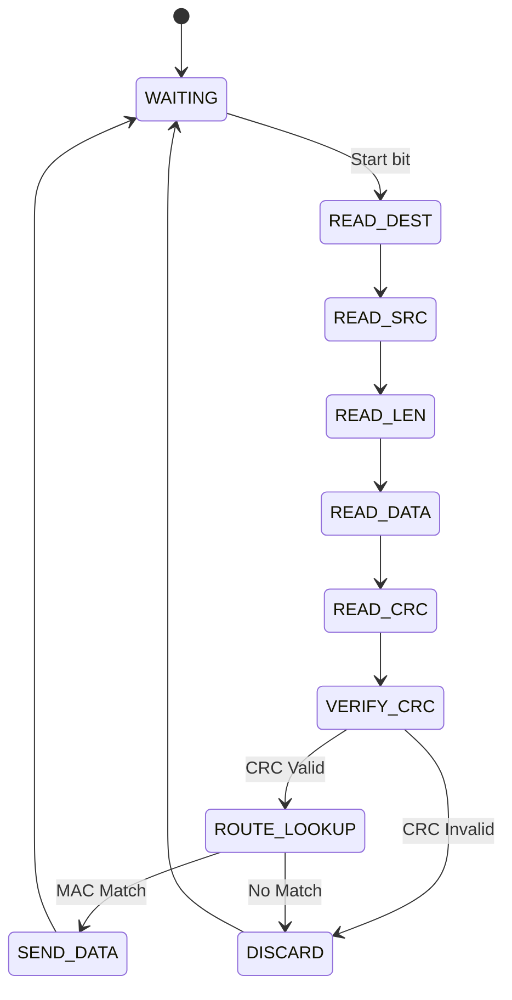

# VHDL LAN Packet Switch (CRC-32 + FSM Based)

This repository contains the final project for the **Computer Architecture** course at [Iran University of Science and Technology (IUST)](https://www.iust.ac.ir/en) in Spring 1404 (Persian calendar, 2025), taught by Professor [Amir Mahdi Hosseini Monazzah](https://webpages.iust.ac.ir/monazzah/).

A configurable LAN packet switch implemented in VHDL, featuring CRC-32 error checking and finite state machine (FSM) based packet processing. this project demonstrates modular hardware design principles for network packet routing.

## 📌 Project Overview

The system processes serial network packets with the following workflow:
1. Parses destination/source MAC addresses (48-bit)
2. Extracts data length (10-bit) and payload
3. Validates packet integrity using CRC-32
4. Routes packets via a static lookup table

## ⚙️ Toolchain
- **HDL**: VHDL-2008
- **Simulation**: Xilinx ISE Design Suite  
  *(Windows 10 VM required - not Win11 compatible)*
- **Testing**: Python 3.x (CRC validation scripts)


## 🎛️ Finite State Machine Diagram



## 📦 Repository Structure
```
.
├── src/
│   ├── crc32.vhdl              # CRC computation core
│   ├── main_switch.vhdl        # Top-level entity
│   └── setting.vhdl            # Routing table
├── test/
│   ├── tb_crc32_calculator.vhdl
│   └── python/
│       ├── crcGen.py           # Test vector generator
│       └── crcReciever.py      # Stream validator
└── pictures/                   # The result of simulation
```

## 👨‍💻 Author
- [Farzad Dehghan Manshadi](https://github.com/farzaddm) 
- [Sourosh Ghaemi](https://github.com/soroush2077)

